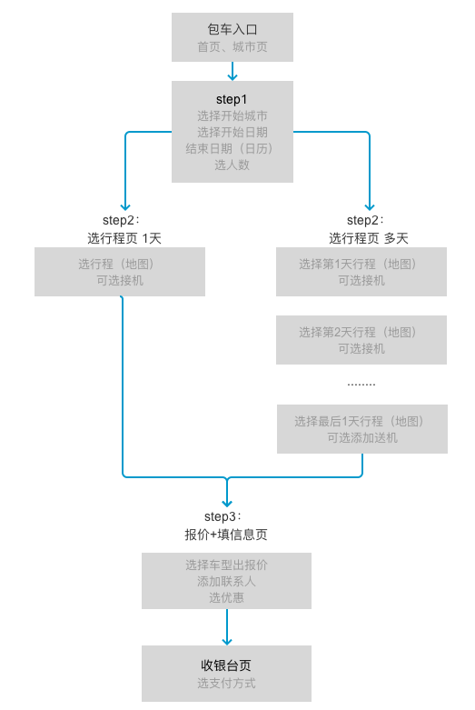
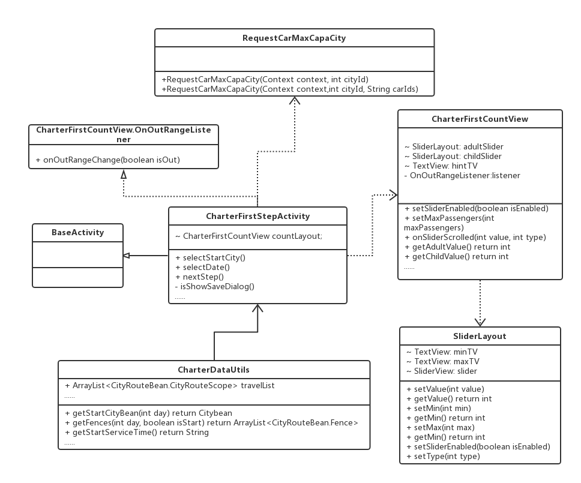
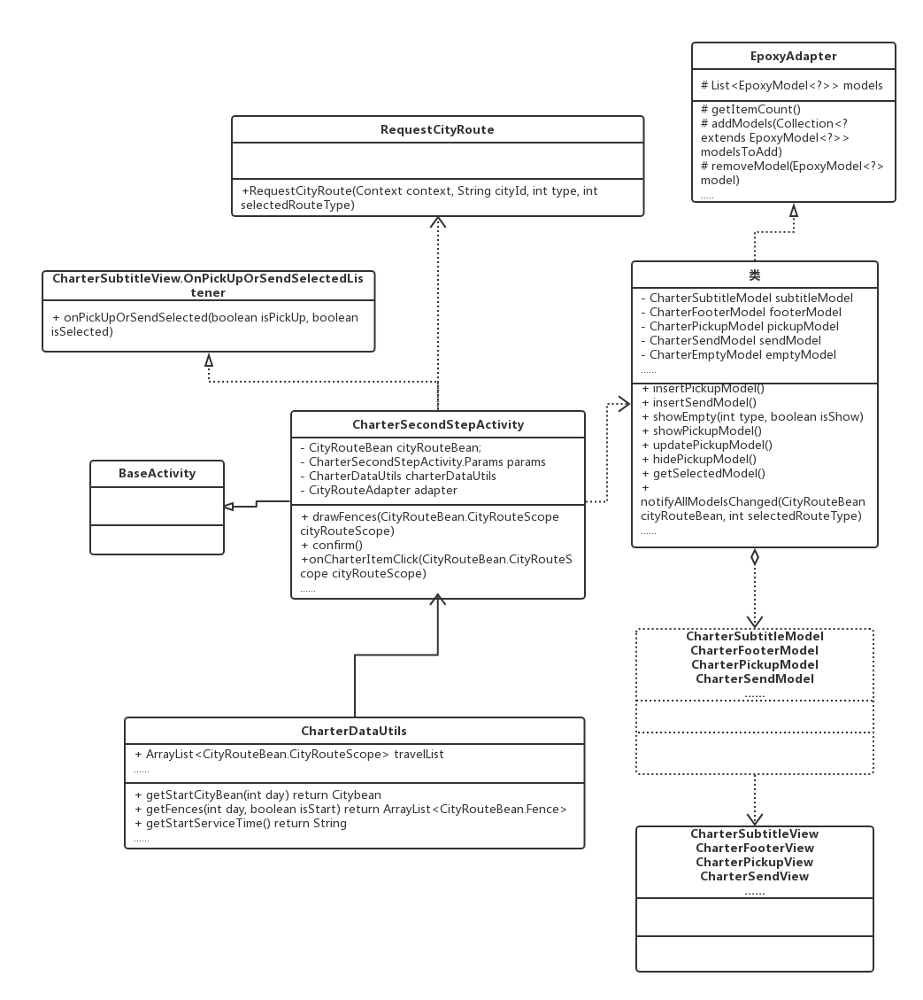
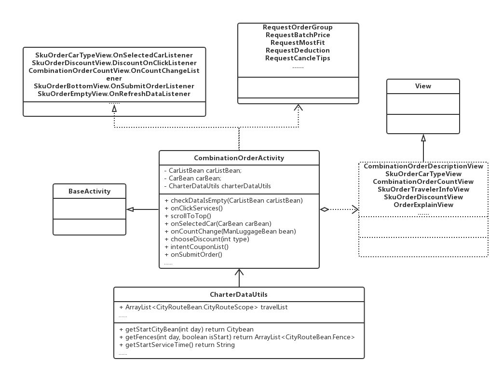
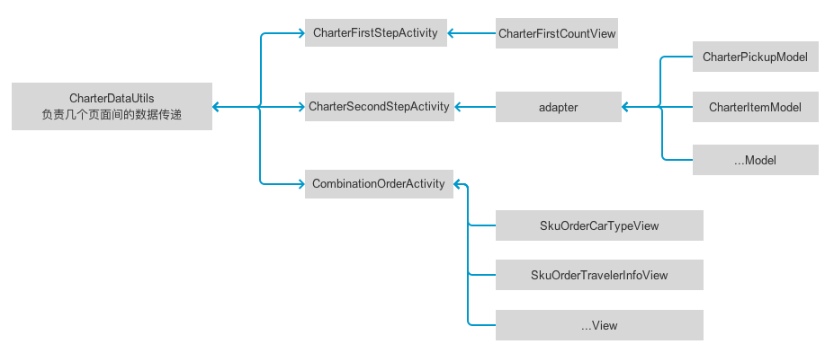

# 组合单下单

[TOC]目录   
* [1. 简述](#index1) 
* [2. 下单流程](#index2) 
   * [2.1 下单描述](#index2.1)  
   * [2.2 下单流程图](#index2.2)  
* [3. 功能描述](#index3)  
    * [3.1 指定司导](#index3.1)
    * [3.2 填写开始城市](#index3.2)  
    * [3.3 选择包车日期](#index3.3)  
    * [3.4 选择出行人数](#index3.4)   
    * [3.5 坐标围栏](#index3.5)  
    * [3.6 选行程](#index3.6)  
    * [3.7 行程单页](#index3.7)
    * [3.8 选车辆](#index3.8)
    * [3.9 修改出行信息](#index3.9)
    * [3.10 选择优惠方式](#index3.10)
    * [3.11 确认订单](#index3.11)  
* [4. 主要类描述](#index4) 
    * [4.1 页面框架](#index4.1)
        * [4.1.1 EventBus](#index4.1.1)
        * [4.1.2 Epoxy](#index4.1.2)
    * [4.2 类图](#index4.2)  
        * [4.2.1 下单step1类图](#index4.2.1)  
        * [4.2.2 下单step2类图](#index4.2.2) 
        * [4.2.3 下单step3类图](#index4.2.3) 
    * [4.3 主要类解释](#index4.3) 
        * [4.3.1 CharterFirstStepActivity.class ](#index4.3.1)  
        * [4.3.2 CharterSecondStepActivity.class](#index4.3.2) 
        * [4.3.3 CombinationOrderActivity.class ](#index4.3.3) 
        * [4.3.4 CharterDataUtils.class](#index4.3.4) 
      
### <a name="index1"/>简述
组合单指用户的一段行程可以自由安排接机、包车、送机的组合方式出行

### <a name="index2"/>下单流程

##### <a name="index2.1"/>下单描述
组合单下单主要分三步：
* step1.填写开始城市、包车日期、出行人数；
* step2.选择每日行程，行程包含：市内一日包车、市内半日包车、周边、跨城、接机、送机；
* step3.报价选车、出行人信息、优惠方式、出行人数、确认订单；

##### <a name="index2.2"/>下单流程图
 

### <a name="index3"/>功能描述

##### <a name="index3.1"/>指定司导
* 根据司导可服务城市及车辆，产生行程订单。
* 指定司导流程：收藏司导列表 - 司导详情 - 包车下单step1
* 指定司导，step1页面，显示司导的头像、姓名、所在国家
* 选择包车开始城市，城市列表需要过滤为这个司导可服务的包车城市
* 选择成人和儿童数，最大值取该司导最大车型的可承载人数

##### <a name="index3.2"/>填写开始城市
* 选择行程的开始城市
* 普通的包车选开始城市，有历史（本次行程内的，离开本次行程就清空历史）、热门城市、A~Z，和搜索栏
* 指定司导下单，开始城市是该司导的可服务城市列表， 只有A~Z模块

##### <a name="index3.3"/>选择包车日期
* 页面下方浮层显示日历，点击开始和结束后，自动关闭浮层
* 包车最长服务时间为半年，前端写死。
* 下次进入选中之前所选日期

##### <a name="index3.4"/>选择出行人数
* step1 未选择城市时，划块置灰禁用，滑块两边数字隐藏，滑块上数字置灰时为0，选城市后默认为2
* step1 成人+儿童超过最大车型时，滑块可继续拖动，显示提示文案
* step3 乘车人数 =（成人数 + 儿童座椅数 * 1.5 + 不用座椅儿童数）、儿童座椅 = 1.5/个乘车人数
* step3 儿童座椅、酒店会产生额外的附加费用

##### <a name="index3.5"/>坐标围栏
* 主要用来提示用户游玩的所属范围
* 围栏种类：市内、周边、跨城市、无围栏、接送机路线
* 需注意香港、澳门坐标偏移

##### <a name="index3.6"/>选行程
* 可选行程：市内一日包车、市内半日包车、周边、跨城、接机、送机
* 第1天可添加接机，最后1天可添加送机；如果只有1天行程，只有接机，第一天和最后一天没有随便转转
* 第2天可以修改开始城市（必须是开始城市圈里的城市）

##### <a name="index3.7"/>行程单页
* 用来查看所选的行程，可以增添加、修改；
* 最后一天选了送机不可再添加，第一天不能删除；
* 所有信息填写完整显示"查看报价"

##### <a name="index3.8"/>选车辆
* 选择要出行的车辆，每辆车有相应的报价

##### <a name="index3.9"/>修改出行信息
* 内容包含：联系人（必填）、手机号（必填）、上车地点、备注

##### <a name="index3.10"/>选择优惠方式
* 优惠方式包含：优惠券、旅游基金
* 有优惠券默认使用优惠券
* 实付金额为0时，直接进入支付结果页。

##### <a name="index3.11"/>确认订单
* 所有以上信息填写完成后，点击"确认订单"会生成订单，跳转到"选择支付页"（0元到"支付结果页"）

### <a name="index4"/>主要类描述

##### <a name="index4.1"/>页面框架
所有activity被拆分成多个模块，每个模块由一个view控制，处理各自的UI逻辑，不相互引用，只对外提供接口，或由EventBus传递消息，activity中实现接口、
并负责一些事件的分发。

###### <a name="index4.1.1"/>[EventBus](https://github.com/greenrobot/EventBus)
部分数据传递使用EventBus,EventBus是一款针对Android优化的发布/订阅事件总线，主要实现线程之间传递消息。
 

###### <a name="index4.1.2"/>[Epoxy](https://github.com/airbnb/epoxy)
step2页选行程列表逻辑较为复杂，使用Epoxy以组合的方式来创建列表，列表中的每个item由一个model代表，model定义了item的布局，id以及span。
model还负责处理数据到视图的绑定，在视图被回收的时候释放资源。如果要显示这些model则把它们添加到Epoxy的adapter中，由adapter来处理复杂的显示问题。
* minSdkVersion 16

##### <a name="index4.2"/>类图

###### <a name="index4.2.1"/>下单step1类图
 

###### <a name="index4.2.2"/>下单step2类图
 

###### <a name="index4.2.3"/>下单step3类图
 

##### <a name="index4.3"/>主要类解释

###### <a name="index4.3.1"/>CharterFirstStepActivity.class 
下单step1：填写开始城市、包车日期、出行人数

| 方法 | 注释 | 
| ------ | ------ | 
| public void selectStartCity()  | 选择开始城市 |  
| public void selectDate() | 选择日期 | 
| public void nextStep() | 下一步 | 
| public void setNextViewEnabled(boolean isEnabled) | 设置"下一步"按钮是否激活 | 
| private boolean isShowSaveDialog() | 退出时检测是否需要"未保存"提示 | 
| public void onEventMainThread(EventAction action) | EventBus回调 |
| public void requestCarMaxCapaCity(int cityId) | 获取当前城市的最大出行人数 |

###### <a name="index4.3.2"/>CharterSecondStepActivity.class
下单step2：选择行程

| 方法 | 注释 | 
| ------ | ------ | 
| private void initMapView()  | 初始化地图SDK |  
| public void showServiceDialog() | 显示联系客服 | 
| public void requestCityRoute(String cityId, int type) | 获取城市行程 | 
| public void onRefresh(int type) | 刷新页面，重新获取城市行程 | 
| public void confirm() | 查看报价或进入下一天行程 | 
| public void onEventMainThread(EventAction action) | EventBus回调 |
| public void requestCarMaxCapaCity(int cityId) | 获取当前城市的最大出行人数 |
| public void intentTravelList() | 进入行程单页 |
| public boolean checkPickUpFlightBean(FlightBean flightBean)| 检测所选航班的开始城市和时间|
| public void updateTitleBar() | 更新状态栏 |
| public void onCharterItemClick(CityRouteScope cityRouteScope) | 选择行程|
| public void updateDrawFences() | 更新围栏 |

###### <a name="index4.3.3"/>CombinationOrderActivity.class 
下单step3：报价选车、出行人信息、优惠方式、出行人数、确认订单；
同"线路确认订单页"

###### <a name="index4.3.4"/>CharterDataUtils.class
用来存储组合单下单数据，单例模式，在step1退出时、step3确定订单时清空数据

| 变量 | 注释 | 
| ------ | ------ | 
| GuidesDetailData guidesDetailData  | 指定司导的信息 |  
| ArrayList<GuideCropBean> guideCropList | 司导可服务城市 | 
| ------ | ------ |
| FlightBean flightBean | 接机：航班信息 | 
| PoiBean pickUpPoiBean | 接机：送达地 | 
| DirectionBean pickUpDirectionBean | 接机：机场到送达地距离及地图坐标 | 
| boolean isSelectedPickUp | 接机：是否选中接机 | 
| ------ | ------ |
| AirPort airPortBean | 送机：机场信息 | 
| PoiBean sendPoiBean | 送机：出发地点 | 
| String sendServerTime | 送机：出发时间 | 
| DirectionBean sendDirectionBean | 送机：出发地到机场距离及地图坐标 | 
| boolean isSelectedSend | 送机：是否选中送机 |
| ------ | ------ |
| ArrayList travelList; | 存储每天的行程信息 | 
| ArrayMap itemInfoList | 存储每天的开始城市、结束城市、开始城市围栏、结束城市围栏 | 

与其它页面的数据交互
 
