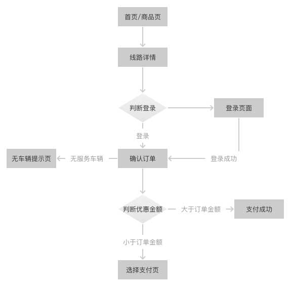

# 包车下单

[TOC]目录  
* [1 下单流程](#index1) 
* [2 页面框架](#index2)
* [3 API接口](#index3) 
* [4 注意事项](#index4)
* [5 API接口](#index5)
* [6 效果图及对应模块](#index6)

## <a name="index1"/>C端下单流程
本文主要描述下单部分流程，从用户选行程开始，到跳转支付页面为止

 

### <a name="index2"/>页面框架

本页面被拆分成以下模块，每个模块由一个view控制，处理各自的UI逻辑，不相互引用，只对外提供接口，activity中实现接口、
并负责一些事件的分发。

 

在该页面中数据是朝单一方向流动的。

 

| 模块 | view | listener |
| ------ | ------ | ------- |
| 线路信息 | SkuOrderDescriptionView |  |
| 出发日期 | SkuOrderChooseDateView | OnSelectedDateListener(日期改变) |
| 选择车型 | SkuOrderCarTypeView | OnSelectedCarListener(车辆改变) |
| 出行人数 | SkuOrderCountView | OnCountChangeListener(onCountChange:人数改变、onAdditionalPriceChange:价格改变)|
| 联系人信息 | SkuOrderTravelerInfoView | |
| 优惠信息 | SkuOrderDiscountView | DiscountOnClickListener(chooseDiscount:选择优惠方式) |
| 其它描述 | OrderExplainView |
| 无服务车辆 | SkuOrderEmptyView | OnRefreshDataListener（刷新页面） |

### <a name="index3"/>API接口

| 接口 | request | 
| ------ | ------ | 
| 获取最近的可服务日期 | RequestGoodsBookDate |
| 获取车辆列表 | RequestPriceSku | 
| 获取优惠券 | RequestMostFit | 
| 获取旅游基金 | RequestDeduction | 
| 获取退改规则 | RequestCancleTips |
| 提交订单（固定线路） | RequestSubmitDaily |
| 提交订单（推荐线路） | RequestSubmitLine |
| 支付接口（应付金额为零，提交订单后直接支付） | RequestPayNo |

接口请求顺序：
 

### <a name="index4"/>注意事项
- 车型的描述，选中时显示，没选中时隐藏
- 优惠信息：默认使用优惠券，并选择优惠面额最大的一张
- 平安保险提示勾选状态可点掉，不影响实际下单
- 上车时间默认9点
- 最大乘车人数：
    - 公式1：成人数+儿童数
    - 儿童数大于0时显示儿童座椅选项，儿童座椅数≤ 儿童数，且 公式2：成人数+不用座椅儿童数+儿童座椅数*1.5≤ 最大乘车人数

### 效果图
